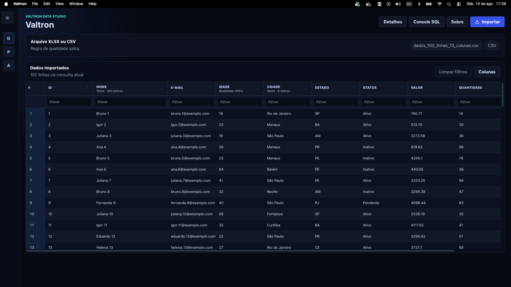
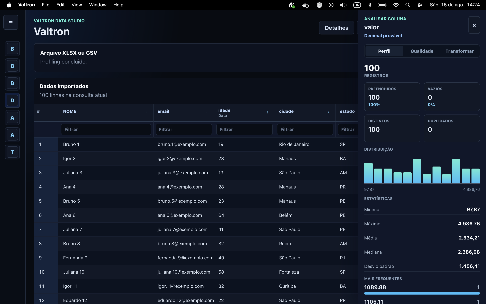

# Valtron

Valtron e uma ferramenta desktop de analise local de dados tabulares: um mini data studio baseado em DuckDB para importar, consultar, editar, validar e explorar arquivos Excel/CSV sem depender de nuvem.

Ele foi desenhado para ingerir arquivos gigantescos em poucos segundos, persistindo os dados localmente em DuckDB e mantendo a interface leve por meio de grade virtualizada, filtros, ordenacao, configuracao de colunas e consultas SQL somente leitura.

## Principais recursos

- Importacao local de `.xlsx`, `.xlsm` e `.csv` para DuckDB.
- Organizacao de documentos por workspaces.
- Grade virtualizada com carregamento em lotes, filtros, ordenacao e estatisticas de qualidade.
- Visibilidade de colunas por documento e largura de colunas persistida localmente.
- Renomeacao de documentos e colunas importadas.
- Edicao de celulas em documentos importados com validacao de tipo no backend.
- Exportacao de documentos para CSV, TSV ou XLSX.
- Console SQL somente leitura para consultas ad hoc.
- Verificacao e instalacao de atualizacoes em builds de producao.

## Interface

Visualizacao principal com a grid de dados importados:



Visualizacao com o painel de workspaces e documentos aberto:



## Documentacao

- [Documentacao tecnica do projeto](docs/PROJETO.md)

## Requisitos

- Node.js 20+
- Rust toolchain com `cargo`
- Dependencias de sistema do Tauri para o seu sistema operacional

## Rodando em desenvolvimento

```bash
npm install
npm run tauri:dev
```

## Build

```bash
npm run tauri:build
```

No macOS, o build padrao gera:

```text
src-tauri/target/release/bundle/macos/Valtron.app
```

## Estrutura

- `src/`: frontend TypeScript servido pelo Vite
- `src-tauri/`: aplicacao Tauri, comandos Rust e persistencia DuckDB
- `src/services/updater/`: servico de atualizacao automatica via plugin updater do Tauri
- `src-tauri/src/lib.rs`: importacao, workspaces, documentos, edicao, exportacao e consultas DuckDB

## Importacao XLSX

O botao `Importar XLSX ou CSV` abre o seletor nativo do sistema. O Rust recebe o caminho do arquivo, importa a primeira planilha ou CSV para o DuckDB local e a tela carrega os dados em lotes de 100 linhas para manter a interface leve com arquivos grandes.

## Atualizacoes

O app usa o plugin updater do Tauri em builds de producao. O endpoint configurado aponta para o ultimo release do GitHub e a instalacao baixa o pacote assinado antes de relancar o aplicativo.
